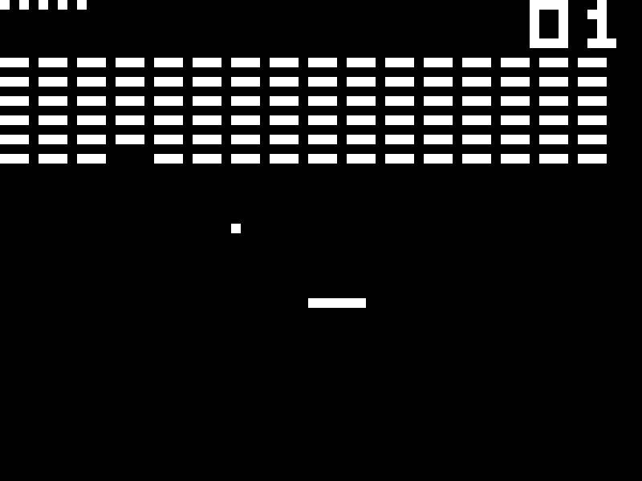

# CHIP-8 Emulator for UEFI

You can learn more about CHIP-8 on the Wikipédia page:
https://en.wikipedia.org/wiki/CHIP-8

## Purpose of this project

The purpose of this project is to show what UEFI is capable of. This emulator is more like a proof than a real usable emulator. Indeed, the ROMs are hardcoded in the file `ROMS.h`. Of course, it's possible to read files in UEFI.

Game selection menu :

BRIX game:

## Compiling this project
To compile this project, you need EDK II, follow the instructions given on their official documentation page which can be find here: https://github.com/tianocore/tianocore.github.io/wiki/Getting-Started-with-EDK-II

## Launching the game

After compiling, rename the generated Chip8.efi to BOOTX64.EFI (or BOOTIA64.EFI or BOOTARM.EFI, depending on the target) and put it on a FAT16 or FAT32 USB key in the path:

/EFI/BOOT/BOOTX64.EFI

## Controls

Same keys as real CHIP-8 computers:
a-f keys and 0-9 keys
